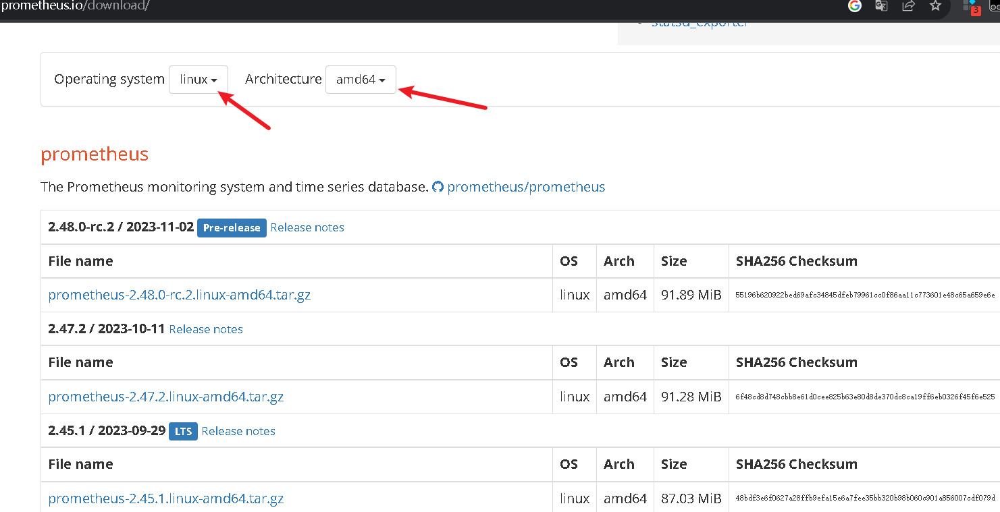

>Prometheus是一个监控平台，通过在被监控目标上抓取度量HTTP端点来收集这些目标的度量。
>本指南将向您展示如何使用Prometheus安装、配置和监控我们的第一个资源。
>您将下载、安装并运行普罗米修斯。您还将下载并安装导出器，这些工具可以在主机和服务上公开时间序列数据。
>我们的第一个导出器将是Prometheus本身，它提供了关于内存使用、垃圾收集等的各种主机级指标。

<!--more-->

## 下载Prometheus
[prometheus 二进制文件下载地址](https://prometheus.io/download/)

> 在下载页面中可以选择系统平台和系统架构的相关安装包



```bash
# 下载
version=2.47.2      # 可去官网查询最新的版本好修改
proxychains4 wget https://github.com/prometheus/prometheus/releases/download/v${version}/prometheus-${version}.linux-amd64.tar.gz
# 解压到 /opt目录下
tar xvfz prometheus-${version}.linux-amd64.tar.gz -C /opt

# 配置
cd /opt/prometheus-${version}.linux-amd64

mkdir -p bin conf 

mv  prometheus  promtool  bin

cd conf

mkdir data
# 创建一个prometheus.yml 文件并添加一下类容
tee >prometheus.yml <<EOF

# Load rules once and periodically evaluate them according to the global 'evaluation_interval'.
rule_files:
  # - "first_rules.yml"
  # - "second_rules.yml"

# A scrape configuration containing exactly one endpoint to scrape:
# Here it's Prometheus itself.
scrape_configs:
  # The job name is added as a label `job=<job_name>` to any timeseries scraped from this config.
  - job_name: 'prometheus'

    # metrics_path defaults to '/metrics'
    # scheme defaults to 'http'.

    static_configs:
    - targets: ['localhost:9090']
  - job_name: 'node_exporter'
    static_configs:
      - targets: ['192.168.1.137:9182', '139.224.115.170:9182', '101.132.64.210:9182', '14.29.244.74:9182', '180.163.43.210:9182', '47.100.219.19:9182', '192.168.1.37:6007', '47.106.234.193:6037', '192.168.1.37:6008', '47.106.234.193:6039', '47.106.234.193:6038', '47.103.38.197:9182', '103.24.176.114:19200', '192.168.1.37:9182', '192.168.1.137:8011','192.168.1.133:9100', '192.168.1.138:9182','192.168.1.150:9182','192.168.1.161:9182','192.168.1.175:9182','192.168.1.176:9182', '192.168.1.137:9100', '192.168.0.180:9100', '192.168.1.147:9100', '192.168.1.132:9100', '192.168.1.161:9182', '103.44.253.242:9100', '192.168.1.88:9182']
  - job_name: 'zwq_test'
    scrape_interval: 1s
    static_configs:
      - targets: ['192.168.1.90:5001']
  - job_name: 'phb'
    scrape_interval: 3s
    static_configs:
      - targets: ['192.168.1.176:9855']
    metrics_path: /metrics
    scheme: http
  - job_name: 'network'
    scrape_interval: 5s
    static_configs:
      - targets: ['192.168.1.5:8008', '192.168.0.175:8008']
    metrics_path: /
    scheme: http

[root@gitlab conf]# clear
[root@gitlab conf]# ls
prometheus.yml
[root@gitlab conf]# cat prometheus.yml
# my global config
global:
  scrape_interval:     15s # Set the scrape interval to every 15 seconds. Default is every 1 minute.
  evaluation_interval: 15s # Evaluate rules every 15 seconds. The default is every 1 minute.
  # scrape_timeout is set to the global default (10s).

# Alertmanager configuration
alerting:
  alertmanagers:
  - static_configs:
    - targets:
      # - alertmanager:9093

# Load rules once and periodically evaluate them according to the global 'evaluation_interval'.
rule_files:
  # - "first_rules.yml"
  # - "second_rules.yml"

# A scrape configuration containing exactly one endpoint to scrape:
# Here it's Prometheus itself.
scrape_configs:
  # The job name is added as a label `job=<job_name>` to any timeseries scraped from this config.
  - job_name: 'prometheus'

    # metrics_path defaults to '/metrics'
    # scheme defaults to 'http'.

    static_configs:
    - targets: ['localhost:9090']
  - job_name: 'node_exporter'
    static_configs:
      - targets: ['192.168.1.137:9182', '139.224.115.170:9182', '101.132.64.210:9182', '14.29.244.74:9182', '180.163.43.210:9182', '47.100.219.19:9182', '192.168.1.37:6007', '47.106.234.193:6037', '192.168.1.37:6008', '47.106.234.193:6039', '47.106.234.193:6038', '47.103.38.197:9182', '103.24.176.114:19200', '192.168.1.37:9182', '192.168.1.137:8011','192.168.1.133:9100', '192.168.1.138:9182','192.168.1.150:9182','192.168.1.161:9182','192.168.1.175:9182','192.168.1.176:9182', '192.168.1.137:9100', '192.168.0.180:9100', '192.168.1.147:9100', '192.168.1.132:9100', '192.168.1.161:9182', '103.44.253.242:9100', '192.168.1.88:9182']
  - job_name: 'zwq_test'
    scrape_interval: 1s
    static_configs:
      - targets: ['192.168.1.90:5001']
  - job_name: 'phb'
    scrape_interval: 3s
    static_configs:
      - targets: ['192.168.1.176:9855']
    metrics_path: /metrics
    scheme: http
  - job_name: 'network'
    scrape_interval: 5s
    static_configs:
      - targets: ['192.168.1.5:8008', '192.168.0.175:8008']
    metrics_path: /
    scheme: http
EOF

# 创建开机自启动服务
cd /etc/systemd/system
# 创建一个prometheus.service
vim prometheus.service
[Unit]
Description=Prometheus Monitoring System
Documentation=Prometheus Monitoring System
 
[Service]
ExecStart=/home/m/prometheus-2.47.2.linux-amd64/bin/prometheus \
  --config.file=/home/m/prometheus-2.47.2.linux-amd64/conf/prometheus.yml --web.enable-admin-api \
  --web.listen-address=:8091
 
[Install]
WantedBy=multi-user.target

# 如果有时Prometheus在运行，需要加载配置
systemctl daemon-reload
# 设置开机自启动
systemctl enalbe  prometheus.service
# 启动
systemctl start  prometheus.service
# 查看状态
systemctl status  prometheus.service
```
